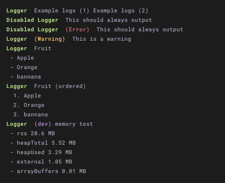

# Node Logger

Very basic reusable node logging package. For use in node scripts only, not for browser use. A way to standardize log output for your users.

## Features:

- Colored Log Output
- Warning Style
- Error Style
- Unordered list (from array)
- Ordered list (from array)
- Memory Usage
- Time Duration
- Configurable



## Usage

Fake example of basic usage below.

```js
  // Pass options to create a new logger instance
  const logger = require("@ulu/node-logger")({
    title: "File Remover", // The title prefix for all log outputs
  });
  
  logger.warn("You are missing your configuration file, using defualts");

  const filesRemoved = removeFiles(); // Example

  logger.list("The following files were removed:", filesRemoved);
```

## Methods

- **log**(...messages)** - Output standard style log
- **required**(...messages) - Always output messages (regardless of options.enabled)
- **error**(...messages) - Output always output error styled log
- **warn**(...messages) - Output warning styled log
- **list**(title, array) - Output bullet list styled log with a title
- **listOrdered**(title, array) - Output ordered (1, 2, 3) list styled log with a title
- **devLog**(...messages) - Output standard style log for developer, Uses the 'options.devEnabled' flag for output condition. Adds options.devTitle prefix
- **memory**(scriptProcess, ...messages) - Display a dev log of the passed processes memory usage, plus any additional messages, process should be the process you want the memory output from ie `process`
- **time**(label) | Start a timer, optional label if using multiple at once
- **timeEnd**(label, ...messages) | Stop timer and output duration, plus any other messages a timer, optional label if using multiple at once

## Options

For color settings see [Chalk library](https://www.npmjs.com/package/chalk) for available colors.

- **enabled** *{Boolean|Function}*  - Whether to output logs (default true),    
- **title** *{String}* -  Title to prefix the log
- **subtitle** *{String}* -  Secondary title prefix (default false) 
- **devTitle** *{String}* -  Dev log title prefix
- **devEnabled** *{Boolean|Function}* -  Whether to output dev type logs
- **colorTitle** *{String}* - (default green)
- **colorSubtitle** *{String}* -  default green)
- **colorError** *{String}* -  (default red)
- **colorWarning** *{String}* - (default yellow)
- **colorDev** *{String}* - (default magenata)


